```python
import pandas as pd
import seaborn as sns
import matplotlib.pyplot as plt
import numpy as np
df = pd.read_csv('/Users/mschneider/Downloads/kc-house-data.csv', encoding='cp1251', index_col='id')

df.head()
```


<div>
<style scoped>
    .dataframe tbody tr th:only-of-type {
        vertical-align: middle;
    }

    .dataframe tbody tr th {
        vertical-align: top;
    }

    .dataframe thead th {
        text-align: right;
    }
</style>
<table border="1" class="dataframe">
  <thead>
    <tr style="text-align: right;">
      <th></th>
      <th>date</th>
      <th>price</th>
      <th>bedrooms</th>
      <th>bathrooms</th>
      <th>sqft_living</th>
      <th>sqft_lot</th>
      <th>floors</th>
      <th>waterfront</th>
      <th>view</th>
      <th>condition</th>
      <th>grade</th>
      <th>sqft_above</th>
      <th>sqft_basement</th>
      <th>yr_built</th>
      <th>yr_renovated</th>
      <th>zipcode</th>
      <th>lat</th>
      <th>long</th>
      <th>sqft_living15</th>
      <th>sqft_lot15</th>
    </tr>
    <tr>
      <th>id</th>
      <th></th>
      <th></th>
      <th></th>
      <th></th>
      <th></th>
      <th></th>
      <th></th>
      <th></th>
      <th></th>
      <th></th>
      <th></th>
      <th></th>
      <th></th>
      <th></th>
      <th></th>
      <th></th>
      <th></th>
      <th></th>
      <th></th>
      <th></th>
    </tr>
  </thead>
  <tbody>
    <tr>
      <th>7129300520</th>
      <td>20141013T000000</td>
      <td>221900.0</td>
      <td>3</td>
      <td>1.00</td>
      <td>1180</td>
      <td>5650</td>
      <td>1.0</td>
      <td>0</td>
      <td>0</td>
      <td>3</td>
      <td>7</td>
      <td>1180</td>
      <td>0</td>
      <td>1955</td>
      <td>0</td>
      <td>98178</td>
      <td>47.5112</td>
      <td>-122.257</td>
      <td>1340</td>
      <td>5650</td>
    </tr>
    <tr>
      <th>6414100192</th>
      <td>20141209T000000</td>
      <td>538000.0</td>
      <td>3</td>
      <td>2.25</td>
      <td>2570</td>
      <td>7242</td>
      <td>2.0</td>
      <td>0</td>
      <td>0</td>
      <td>3</td>
      <td>7</td>
      <td>2170</td>
      <td>400</td>
      <td>1951</td>
      <td>1991</td>
      <td>98125</td>
      <td>47.7210</td>
      <td>-122.319</td>
      <td>1690</td>
      <td>7639</td>
    </tr>
    <tr>
      <th>5631500400</th>
      <td>20150225T000000</td>
      <td>180000.0</td>
      <td>2</td>
      <td>1.00</td>
      <td>770</td>
      <td>10000</td>
      <td>1.0</td>
      <td>0</td>
      <td>0</td>
      <td>3</td>
      <td>6</td>
      <td>770</td>
      <td>0</td>
      <td>1933</td>
      <td>0</td>
      <td>98028</td>
      <td>47.7379</td>
      <td>-122.233</td>
      <td>2720</td>
      <td>8062</td>
    </tr>
    <tr>
      <th>2487200875</th>
      <td>20141209T000000</td>
      <td>604000.0</td>
      <td>4</td>
      <td>3.00</td>
      <td>1960</td>
      <td>5000</td>
      <td>1.0</td>
      <td>0</td>
      <td>0</td>
      <td>5</td>
      <td>7</td>
      <td>1050</td>
      <td>910</td>
      <td>1965</td>
      <td>0</td>
      <td>98136</td>
      <td>47.5208</td>
      <td>-122.393</td>
      <td>1360</td>
      <td>5000</td>
    </tr>
    <tr>
      <th>1954400510</th>
      <td>20150218T000000</td>
      <td>510000.0</td>
      <td>3</td>
      <td>2.00</td>
      <td>1680</td>
      <td>8080</td>
      <td>1.0</td>
      <td>0</td>
      <td>0</td>
      <td>3</td>
      <td>8</td>
      <td>1680</td>
      <td>0</td>
      <td>1987</td>
      <td>0</td>
      <td>98074</td>
      <td>47.6168</td>
      <td>-122.045</td>
      <td>1800</td>
      <td>7503</td>
    </tr>
  </tbody>
</table>
</div>


## Задача 1
Постройте график <br>
Назовите график <br>
Сделайте именование оси x и оси y <br>
Сделайте выводы <br>

### 1.1. Скачать данные по ссылке
### 1.2 Изучите стоимости недвижимости
### 1.3 Изучите распределение квадратуры жилой
### 1.4 Изучите распределение года постройки


```python
df['price'] = df['price'].astype(int)
df.head()
```


<div>
<style scoped>
    .dataframe tbody tr th:only-of-type {
        vertical-align: middle;
    }

    .dataframe tbody tr th {
        vertical-align: top;
    }

    .dataframe thead th {
        text-align: right;
    }
</style>
<table border="1" class="dataframe">
  <thead>
    <tr style="text-align: right;">
      <th></th>
      <th>date</th>
      <th>price</th>
      <th>bedrooms</th>
      <th>bathrooms</th>
      <th>sqft_living</th>
      <th>sqft_lot</th>
      <th>floors</th>
      <th>waterfront</th>
      <th>view</th>
      <th>condition</th>
      <th>grade</th>
      <th>sqft_above</th>
      <th>sqft_basement</th>
      <th>yr_built</th>
      <th>yr_renovated</th>
      <th>zipcode</th>
      <th>lat</th>
      <th>long</th>
      <th>sqft_living15</th>
      <th>sqft_lot15</th>
    </tr>
    <tr>
      <th>id</th>
      <th></th>
      <th></th>
      <th></th>
      <th></th>
      <th></th>
      <th></th>
      <th></th>
      <th></th>
      <th></th>
      <th></th>
      <th></th>
      <th></th>
      <th></th>
      <th></th>
      <th></th>
      <th></th>
      <th></th>
      <th></th>
      <th></th>
      <th></th>
    </tr>
  </thead>
  <tbody>
    <tr>
      <th>7129300520</th>
      <td>20141013T000000</td>
      <td>221900</td>
      <td>3</td>
      <td>1.00</td>
      <td>1180</td>
      <td>5650</td>
      <td>1.0</td>
      <td>0</td>
      <td>0</td>
      <td>3</td>
      <td>7</td>
      <td>1180</td>
      <td>0</td>
      <td>1955</td>
      <td>0</td>
      <td>98178</td>
      <td>47.5112</td>
      <td>-122.257</td>
      <td>1340</td>
      <td>5650</td>
    </tr>
    <tr>
      <th>6414100192</th>
      <td>20141209T000000</td>
      <td>538000</td>
      <td>3</td>
      <td>2.25</td>
      <td>2570</td>
      <td>7242</td>
      <td>2.0</td>
      <td>0</td>
      <td>0</td>
      <td>3</td>
      <td>7</td>
      <td>2170</td>
      <td>400</td>
      <td>1951</td>
      <td>1991</td>
      <td>98125</td>
      <td>47.7210</td>
      <td>-122.319</td>
      <td>1690</td>
      <td>7639</td>
    </tr>
    <tr>
      <th>5631500400</th>
      <td>20150225T000000</td>
      <td>180000</td>
      <td>2</td>
      <td>1.00</td>
      <td>770</td>
      <td>10000</td>
      <td>1.0</td>
      <td>0</td>
      <td>0</td>
      <td>3</td>
      <td>6</td>
      <td>770</td>
      <td>0</td>
      <td>1933</td>
      <td>0</td>
      <td>98028</td>
      <td>47.7379</td>
      <td>-122.233</td>
      <td>2720</td>
      <td>8062</td>
    </tr>
    <tr>
      <th>2487200875</th>
      <td>20141209T000000</td>
      <td>604000</td>
      <td>4</td>
      <td>3.00</td>
      <td>1960</td>
      <td>5000</td>
      <td>1.0</td>
      <td>0</td>
      <td>0</td>
      <td>5</td>
      <td>7</td>
      <td>1050</td>
      <td>910</td>
      <td>1965</td>
      <td>0</td>
      <td>98136</td>
      <td>47.5208</td>
      <td>-122.393</td>
      <td>1360</td>
      <td>5000</td>
    </tr>
    <tr>
      <th>1954400510</th>
      <td>20150218T000000</td>
      <td>510000</td>
      <td>3</td>
      <td>2.00</td>
      <td>1680</td>
      <td>8080</td>
      <td>1.0</td>
      <td>0</td>
      <td>0</td>
      <td>3</td>
      <td>8</td>
      <td>1680</td>
      <td>0</td>
      <td>1987</td>
      <td>0</td>
      <td>98074</td>
      <td>47.6168</td>
      <td>-122.045</td>
      <td>1800</td>
      <td>7503</td>
    </tr>
  </tbody>
</table>
</div>


```python
# Построение гистограммы стоимости недвижимости

plt.figure(figsize=(6, 4))
plt.hist(df['price'])
plt.xlabel('Стоимость недвижимости')
plt.ylabel('Количество домов')
plt.title('Распределение стоимости недвижимости')

plt.xticks(range(0, 9000000, 1000000), ['0', '1M', '2M', '3M', '4M', '5M', '6M', '7M', '8M'])
plt.ylim(0, 20000)

plt.show()
```


    
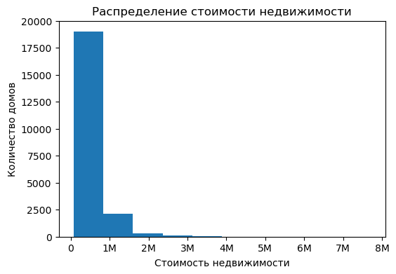
    


```python
Хотя стоимость домов в представленной выборке варьируюется в диапазоне от 75.000 до 7.700.000, цена большинства домов не превышает 1.000.000
```


```python
# Построение гистограммы квадратуры жилой площади
plt.hist(df['sqft_living'], bins=50)
plt.xlabel('Квадратура жилой площади')
plt.ylabel('Количество домов')
plt.title('Распределение квадратуры жилой площади')
plt.show()
```


    
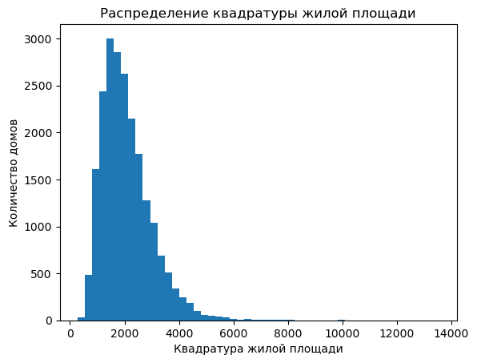
    


Мы наблюдаем нормальное распределение квадратуры жилой площади. Больше всего домов со средней квадратурой, при этом количество домов равномерно уменьшается по направлению к максимальной и минимальной квадратуре жилой площади.


```python
# Построение гистограммы года постройки

plt.hist(df['yr_built'], bins=50)
plt.xlabel('Год постройки')
plt.ylabel('Количество домов')
plt.title('Распределение года постройки')
plt.show()
```


    
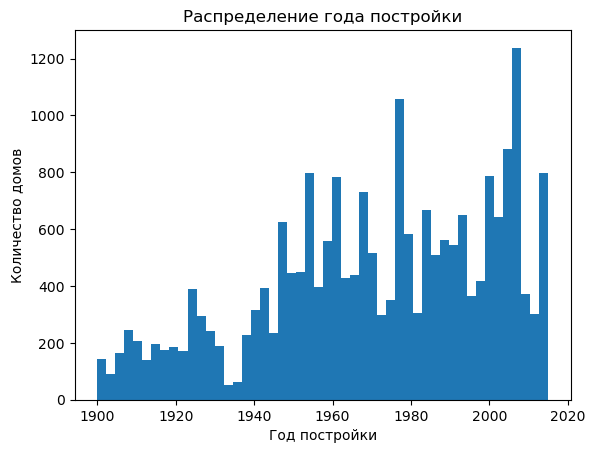
    


Количество домов, в зависимости от года постройки распределено неравномерно. Можно выделить крайне малое количество домов построенных в годы экономического кризиса, в конце 1930-х годов, в остальные периоды количество построенных домов зависело от разнообразных факторов, которые нужно дополнительрно анализировать.

## 2 задача
### 2.1 Изучите распределение домов от наличия вида на набережную
Постройте график
Сделайте выводы
### 2.2 Изучите распределение этажей домов
### 2.2 Изучите распределение состояния домов


```python
# Группировка данных по наличию вида на набережную и подсчет количества домов
waterfront_counts = df['waterfront'].value_counts()

# Построение графика
plt.bar(['No Waterfront', 'Waterfront'], waterfront_counts)
plt.xlabel('Наличие вида на набережную')
plt.ylabel('Количество домов')
plt.title('Распределение домов от наличия вида на набережную')
plt.show()
```


    
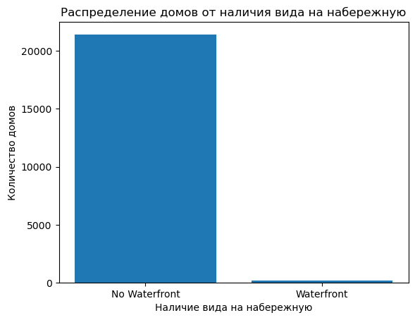
    


Подовляющее большинство домов не имеет вида на набережную


```python
# Группировка данных по количеству этажей и подсчет количества домов
floors_counts = df['floors'].value_counts()

# Построение графика
plt.bar(floors_counts.index, floors_counts)
plt.xlabel('Количество этажей')
plt.ylabel('Количество домов')
plt.title('Распределение домов от количества этажей')
plt.xticks(rotation=90)
plt.show()
```


    
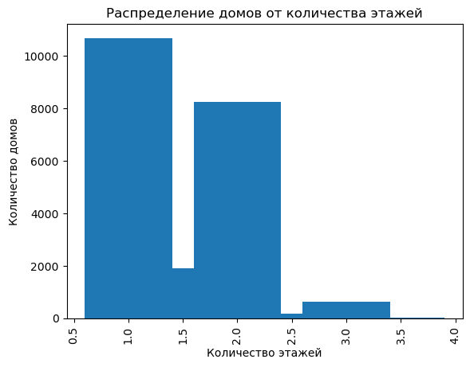
    


Бошльшиснство домов имеет от 1 или 2 этажей, также прествлена небольшая группа домов (чуть меньше 2000), с этажностью 1,5 этажа. Есть также груипа домов в 3 этажа, далее по убыванию идут дома с этажностью 2,5 этажа. И самая малая группа - это дома с этажностью 3,5.


```python
# Группировка данных по состоянию домов и подсчет количества домов
condition_counts = df['condition'].value_counts()

# Построение графика
plt.bar(condition_counts.index, condition_counts)
plt.xlabel('Состояние домов')
plt.ylabel('Количество домов')
plt.title('Распределение домов от состояния')
plt.show()
```


    
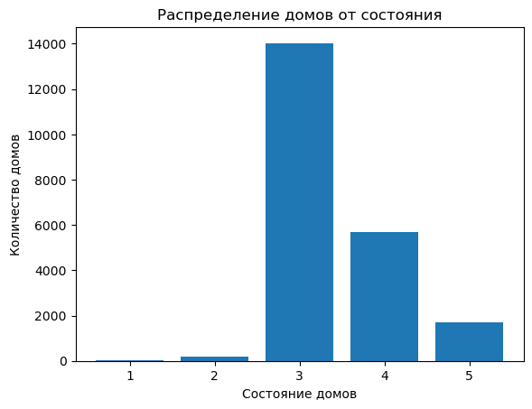
    


Около 14000 домов находятся в состоянии (3), менее 6000 домов в состоянии (4), менее 2000 омов состоянии (5). Наименее предствленные группы - это дома с сосотояниием (2) и (1)

## 3 задача
Исследуйте, какие характеристики недвижимости влияют на стоимость недвижимости, с применением не менее 5 диаграмм из урока.
Анализ сделайте в формате storytelling: дополнить каждый график письменными выводами и наблюдениями.


```python
plt.scatter(df['sqft_living'], df['price'])
plt.xlabel('Площадь жилой площади')
plt.ylabel('Стоимость недвижимости')
plt.title('Влияние площади жилой площади на стоимость недвижимости')
plt.show()
```


    
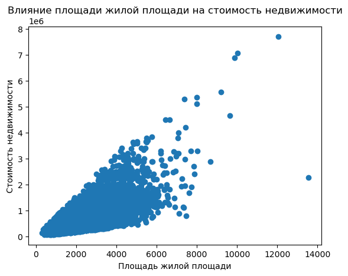
    


На диаграмме рассеяния видно, что с увеличением площади жилой площади наблюдается тенденция к повышению стоимости недвижимости. Это говорит о положительной зависимости между этими двумя переменными.


```python
plt.hist(df['bedrooms'], bins=10)
plt.xlabel('Количество спален')
plt.ylabel('Количество домов')
plt.title('Распределение количества спален')
plt.show()
```


    
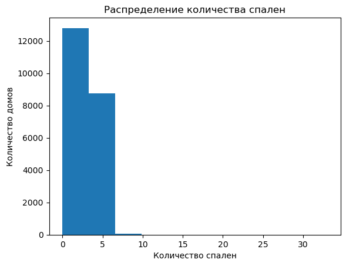
    


Гистограмма позволяет увидеть распределение количества спален в недвижимости. Это может указывать на популярность домов среднего размера, подходящих для семей.


```python
plt.hist(df['bathrooms'], bins=10)
plt.xlabel('Количество ванных комнат')
plt.ylabel('Количество домов')
plt.title('Распределение количества ванных комнат')
plt.show()
```


    
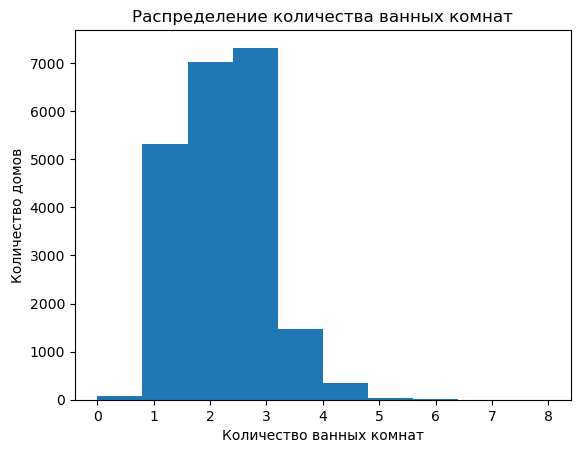
    


Гистограмма позволяет увидеть распределение количества ванных комнат в недвижимости. Большинство домов имеют 2 или 2,5 ванных комнаты. Это может указывать на популярность домов с несколькими ванными комнатами для удобства жильцов.


```python
waterfront_counts = df['waterfront'].value_counts()

plt.pie(waterfront_counts, labels=['No Waterfront', 'Waterfront'])
plt.title('Распределение видов на набережную')
plt.show()
```


    
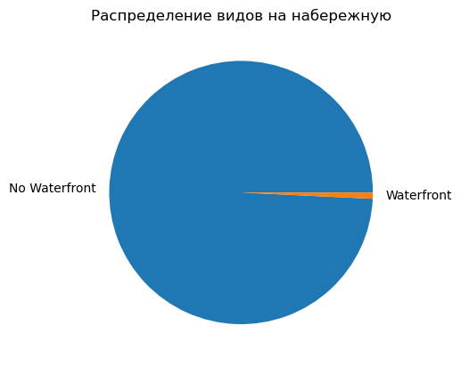
    


Круговая диаграмма позволяет увидеть соотношение домов с видом на набережную и без него. Большинство домов (примерно 99%) не имеют вид на набережную, в то время как только небольшая доля домов (примерно 1%) имеют вид на набережную.


```python
plt.boxplot([df[df['grade'] == i]['price'] for i in range(1, 14)])
plt.xlabel('Оценка дома')
plt.ylabel('Стоимость недвижимости')
plt.title('Влияние оценки дома на стоимость недвижимости')
plt.xticks(range(1, 14), range(1, 14))
plt.show()
```


    
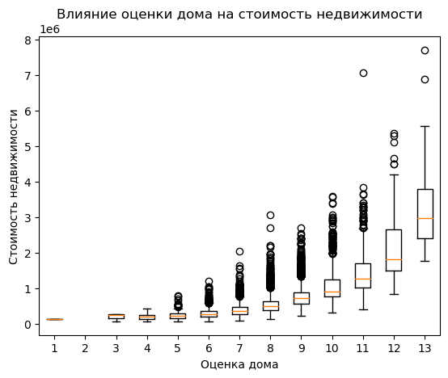
    


Диаграмма "ящик с усами" позволяет увидеть распределение стоимости недвижимости для каждой оценки дома. Чем выше оценка дома, тем больше разброс стоимости недвижимости. Это говорит о том, что оценка дома может быть важным фактором, влияющим на стоимость недвижимости.
